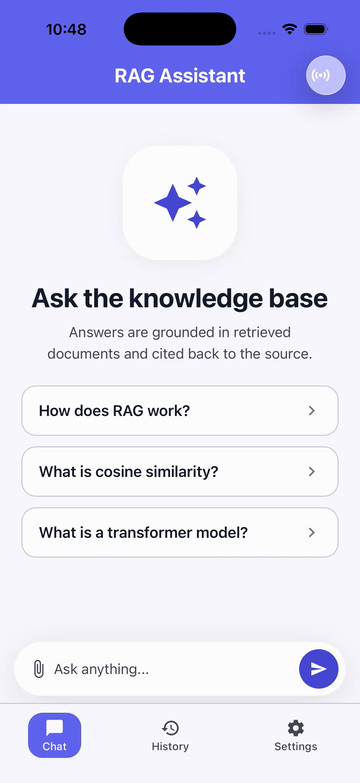
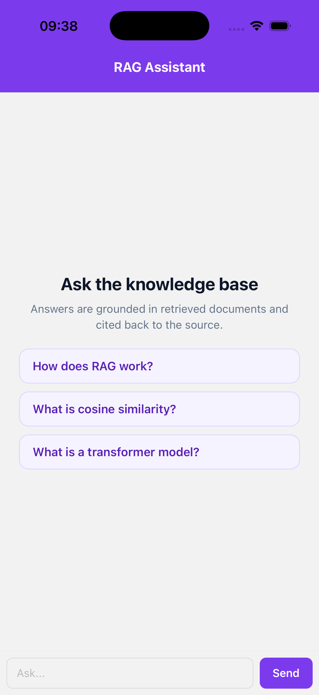
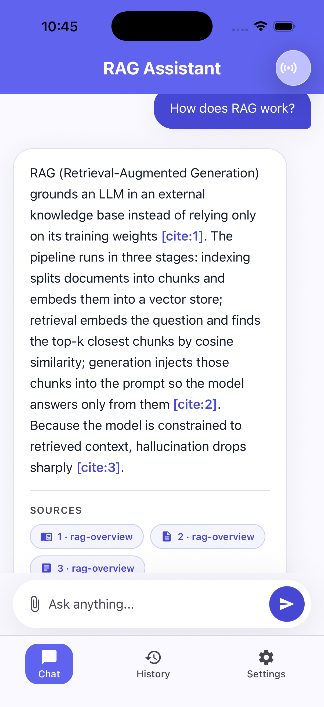
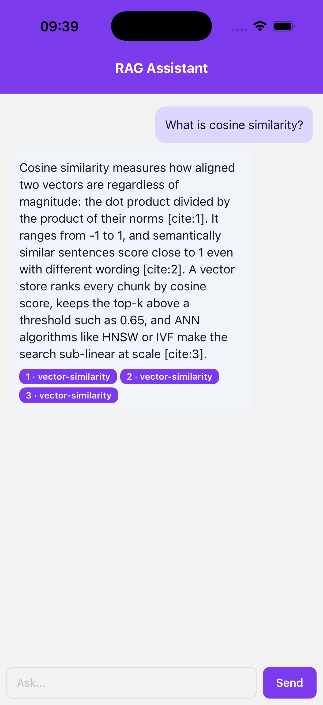
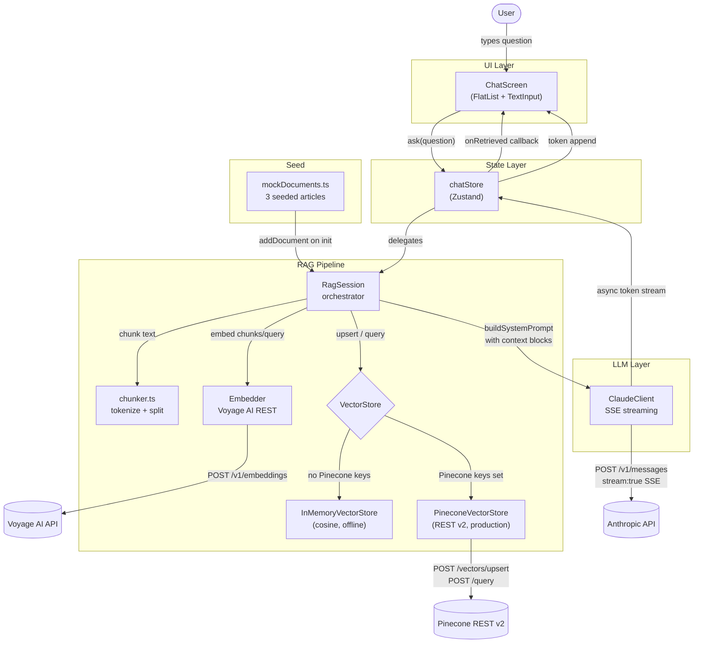

# expo-rag-vector

A proof-of-concept mobile chatbot built with **Expo SDK 54**, **React Native**, **TypeScript** (strict mode), **Zustand**, and the **Anthropic Claude** + **Voyage AI** REST APIs. It implements a complete **RAG (Retrieval-Augmented Generation)** pipeline entirely on the client: documents are chunked, embedded via Voyage, stored in either an in-memory vector store or **Pinecone**, and answered by Claude with citation chips pointing back to the source chunks. The app ships with realistic seed documents and a fully offline demo backend, so it is demoable on a simulator with no API keys at all.

## Demo

Live demo recorded on iOS Simulator (iPhone 17 Pro). With no API keys set, the app runs in offline demo mode: tapping a suggested question streams a grounded, cited answer drawn from the seeded documents.



## Screenshots

| Chat - empty state | Answer with citations | Citation chips |
|---|---|---|
|  |  |  |

## Features

- RAG pipeline split into four single-purpose modules: `chunker`, `embedder`, `vectorStore`, `ragSession`
- Token-aware text splitter with configurable chunk size (default 512 tokens) and overlap (64 tokens)
- Voyage AI embedding client (`voyage-3`, 1024-dim vectors) using native `fetch` - no extra SDK
- Dual vector store: `InMemoryVectorStore` (cosine similarity, offline/demo) and `PineconeVectorStore` (REST v2 API, production)
- Cosine similarity retrieval with top-k and minimum score threshold (default: top 5, score >= 0.65)
- Anthropic Claude streaming via Server-Sent Events surfaced as an async generator
- Real-time token streaming into the Zustand chat store - UI updates on every token
- Citation chips rendered before the first token arrives via an `onRetrieved` callback
- Automatic mock document seeding on first launch so the app answers questions out of the box
- Offline demo backend (`demoSession.ts`): with no Anthropic/Voyage keys, questions stream canned, grounded answers with real citation chips so the app is demoable with zero secrets
- expo-router file-based navigation; AsyncStorage for conversation persistence

## Stack

- **Expo SDK 54** + **React Native 0.81** + **TypeScript** (strict)
- **expo-router 6** for file-based navigation
- **Zustand 4.5** for chat and RAG session state
- **Voyage AI** (`voyage-3`) for document and query embeddings
- **Anthropic Claude** (`claude-opus-4-6`) for grounded answer generation with streaming SSE
- **Pinecone REST v2** for production vector storage (optional - falls back to in-memory)
- **AsyncStorage** for conversation persistence

## Architecture

```
src/
├── rag/
│   ├── chunker.ts            # Token-aware text splitter with overlap
│   ├── embedder.ts           # Voyage AI embeddings client (native fetch)
│   ├── vectorStore.ts        # VectorStore interface + InMemory + Pinecone adapters
│   ├── ragSession.ts         # Embed -> retrieve -> generate orchestrator
│   ├── demoSession.ts        # Offline backend: canned grounded answers + citations (no keys)
│   └── mockDocuments.ts      # Seed documents for offline / demo mode
├── llm/
│   └── claudeClient.ts       # Anthropic streaming client (SSE async generator)
└── features/chat/
    ├── chatStore.ts          # Zustand store: seeds mock docs, drives chat UI
    └── ChatScreen.tsx        # FlatList chat UI with citation chips
app/
├── _layout.tsx               # Stack root layout (expo-router)
└── index.tsx                 # Mounts ChatScreen
```



## Mock data

`src/rag/mockDocuments.ts` exports three articles that are automatically embedded into the `InMemoryVectorStore` at app startup when no Pinecone credentials are set:

| sourceId | Topic | Demo query |
|---|---|---|
| `rag-overview` | What RAG is, the three pipeline stages (index, retrieve, generate), and how it reduces hallucination | "How does RAG work?" |
| `vector-similarity` | Cosine similarity formula, score ranges, threshold filtering, and ANN algorithms (HNSW, IVF) | "What is cosine similarity?" |
| `transformer-basics` | Transformer self-attention, encoder vs decoder stacks, multi-head attention, positional embeddings | "What is a transformer model?" |

Each article is split by `chunker.ts` into ~512-token chunks with 64-token overlap. In the live pipeline a Voyage AI key is required to embed these documents; in offline demo mode (no keys) the same articles back the canned, cited answers shown in the screenshots.

## Run

```bash
npm install

# Offline demo - no keys needed (canned grounded answers + citation chips)
npx expo start --ios

# Live pipeline - Anthropic + Voyage keys (in-memory store with seed docs)
EXPO_PUBLIC_ANTHROPIC_API_KEY=sk-ant-... \
EXPO_PUBLIC_VOYAGE_API_KEY=pa-... \
npx expo start --ios

# Full production setup with Pinecone
EXPO_PUBLIC_ANTHROPIC_API_KEY=sk-ant-... \
EXPO_PUBLIC_VOYAGE_API_KEY=pa-... \
EXPO_PUBLIC_PINECONE_API_KEY=... \
EXPO_PUBLIC_PINECONE_HOST=https://your-index-host.pinecone.io \
npx expo start
```

The app auto-selects the backend: with no Anthropic/Voyage keys it runs the offline demo backend; with those keys set it runs the live pipeline, using Pinecone when `EXPO_PUBLIC_PINECONE_API_KEY` and `EXPO_PUBLIC_PINECONE_HOST` are both present and otherwise the in-memory store seeded with the three mock articles.
